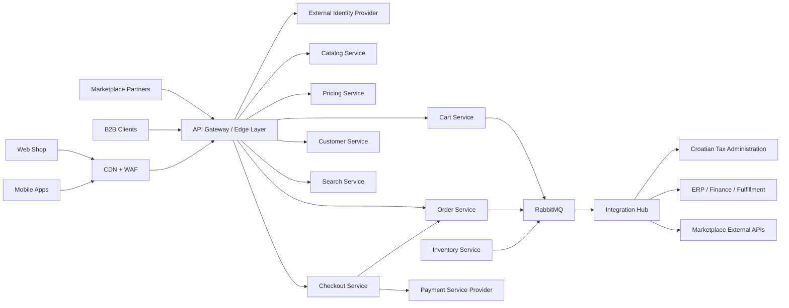
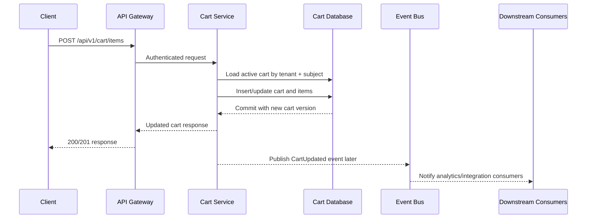
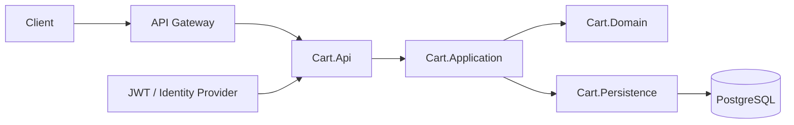

# Cart API Submission: Architecture And Implementation Strategy

## Purpose

This document describes the target high-level architecture for a global online retail platform and explains the implementation strategy behind the submitted code sample.

The `cartapi` repository is intentionally not the full platform. It is a minimal cart-service slice used to demonstrate architecture discipline, service boundaries, persistence, security, and operational readiness in code.

## 1. System Context And Assumptions

### Business Context

- The platform serves a single global retail client across multiple sales channels.
- Expected traffic is very high, with millions of daily users and strong traffic spikes during promotions, launches, and seasonal events.
- Two cross-functional teams will work on the platform, so the architecture must support parallel delivery and clear ownership boundaries.

### Sales Channels

- Web shop
- Mobile applications
- Marketplace integrations
- B2B integrations

### Working Assumptions

- Customer-facing experiences must stay responsive during peak load.
- Payment, tax, fulfillment, and marketplace side effects should not unnecessarily increase cart or browsing latency.
- The platform should be operable in a cloud environment with horizontal scaling, centralized observability, and automated delivery.
- The architecture should support country-specific compliance integrations without coupling them directly into every commerce service.
- Frontend implementation details are out of scope for this document; channels are described only at the integration boundary.

### What This Submission Implements

- A minimal shopping cart Web API with a database
- A production-minded internal structure for that service
- Selected non-functional concerns such as versioning, health checks, testing approach, and delivery discipline

### What This Submission Does Not Implement

- Full checkout flow
- Real payment orchestration
- Inventory reservation
- Marketplace synchronization workers
- Croatian Tax Administration integration in code
- Full distributed eventing in code

## 2. High-Level Architecture

The target platform is a service-oriented commerce backend behind an edge layer. Customer-facing flows such as browsing, pricing retrieval, cart mutation, and order placement are primarily synchronous. Downstream integrations and cross-domain propagation are event-driven where appropriate.

### System Context Diagram

### Architectural Direction

- Use an API gateway or edge layer in front of backend services.
- Keep core commerce domains independently deployable in the target architecture.
- Use `RabbitMQ` for asynchronous messaging between services and integration workflows.
- Keep the cart domain as a transactional source of truth in its own service/database boundary.
- Treat the edge layer as the internet-facing boundary that combines CDN, WAF, routing, and policy enforcement concerns.
- Introduce channel-specific BFFs only if web or mobile needs diverge enough that a shared gateway-to-service model becomes inefficient.

## 3. Key Components And Responsibilities

### Edge Layer

The edge layer is the full internet-facing boundary of the platform. In this architecture it includes CDN, WAF, API gateway capabilities, and optionally channel-specific BFFs.

- terminates and protects incoming traffic before it reaches internal services
- centralizes routing, coarse-grained auth checks, and traffic-control policies
- provides a stable external entry point while allowing backend services to evolve internally
- keeps internal services off the public internet

#### CDN

- serves static assets and cacheable public content close to users
- reduces latency for browsing-heavy channels such as web and mobile
- absorbs traffic spikes for assets such as product images and static frontend files

Important boundary:

- use CDN acceleration for static assets and selected cacheable reads
- do not treat the CDN as the owner of transactional state such as cart data

#### WAF

- filters malicious or abusive internet traffic before it reaches the API gateway
- helps block common web attack patterns, bad bots, and suspicious request shapes
- provides a first security barrier for public commerce endpoints

#### API Gateway

- routes requests to internal services
- applies rate limiting, request shaping, and coarse token validation
- propagates correlation headers and other shared request metadata
- provides a stable client-facing API surface across channels

#### Optional BFFs

Backend-for-Frontend components are optional and should be introduced only when channel needs diverge significantly.

Examples where a BFF makes sense:

- web and mobile need different payload shapes or aggregation patterns
- one channel needs to combine data from several services in a way that would otherwise create excessive client chatter
- channel-specific release cadence or UI composition needs start to pull against a single shared API surface

Recommended position in this architecture:

- keep the API gateway as the default shared entry path
- add web or mobile BFFs behind the edge layer when channel divergence creates clear value
- avoid adding BFFs by default before there is a real need

Examples:

- a `Web BFF` could optimize payloads for browser-based storefront flows
- a `Mobile BFF` could provide more compact or aggregated responses for mobile app screens

Non-goal:

- BFFs should shape and aggregate data for a channel
- they should not become the place where core cart, pricing, or order business rules live

### Identity Provider

- Authenticates customers, internal users, and partner clients
- Issues JWTs or equivalent tokens for downstream authorization
- Keeps authentication lifecycle concerns outside individual business services

### Catalog Service

- Owns product definitions, attributes, media references, and publish state
- Supports read-heavy workloads
- Benefits strongly from caching and search indexing

### Pricing Service

- Resolves product prices, currencies, and pricing rules
- Supports channel- or market-specific price calculation
- Can be optimized independently from catalog and cart

### Cart Service

- Owns active shopping cart state
- Validates cart mutations
- Applies cart-level business rules such as item merge, quantity updates, and ownership checks
- Persists transactional cart data
- Publishes cart-related events for downstream consumers when needed

### Checkout Service

- Coordinates order placement from an accepted cart state
- Orchestrates payment initiation and downstream order creation
- Handles idempotency and higher-stakes write flows later in the platform evolution

### Order Service

- Owns order lifecycle, order state transitions, and order history
- Acts as a durable source for post-purchase processes

### Inventory Service

- Tracks stock levels and availability
- Publishes inventory changes for catalog/search refresh and operational workflows

### Integration Hub

- Encapsulates external system integration concerns
- Handles marketplace, B2B, finance, tax, and fulfillment integrations
- Protects core domain services from protocol, retry, and compliance complexity

## 4. Communication Patterns

### Synchronous Communication

Use synchronous request-response communication for:

- browsing and search reads
- pricing reads
- reading the active cart
- mutating the active cart
- initiating checkout

Reasoning:

- these are user-driven flows with immediate feedback requirements
- they are easier to explain and operate for core customer interactions

### Asynchronous Communication

Use asynchronous messaging for:

- cart-updated notifications
- order-created events
- inventory updates
- marketplace propagation
- tax, ERP, invoicing, and fulfillment workflows

Reasoning:

- reduces coupling between domains
- absorbs spikes
- supports retries and temporary downstream outages
- avoids making customer response time depend on every external integration

Broker choice:

- `RabbitMQ` is the default asynchronous messaging backbone for this architecture
- it is a good fit for operational workflows, integration dispatch, and business-event propagation in this platform scope

### Reliability Patterns

- Use an outbox pattern for externally visible domain events where consistency matters.
- Treat event handlers as idempotent consumers.
- Use correlation IDs end to end so a customer action can be traced across services and integrations.

### Cart Update Flow Diagram

## 5. Technology Choices

### Backend Platform

- `.NET 10`
- `ASP.NET Core Web API`

Reasoning:

- strong fit for high-throughput APIs
- mature tooling, diagnostics, and cloud hosting options
- good team productivity

### Transactional Data

- `PostgreSQL`

Reasoning:

- strong transactional reliability
- mature support for relational integrity and indexing
- good fit for the cart slice and many operational business services

### Caching

- `Redis` or equivalent distributed cache for read-heavy data such as catalog, pricing snapshots, and session-adjacent accelerators

Important boundary:

- cart state should not be cache-owned data
- the cart database remains the source of truth

### Messaging

- `RabbitMQ`

Reasoning:

- needed for decoupled propagation of order, inventory, integration, and analytical events
- well suited for pragmatic service-to-service asynchronous workflows in this architecture

### Search

- `OpenSearch` or `Elasticsearch`-class search engine for catalog discovery

### Runtime And Deployment

- containers
- `Kubernetes`
- CDN/WAF in front of the edge layer

Reasoning:

- supports horizontal scaling, rolling deployments, health-based traffic management, and operational consistency across services

## 6. Scaling And Real-Time Strategy

### Horizontal Scaling

- Keep API services stateless where possible.
- Scale services horizontally behind the edge layer.
- Separate read-heavy services such as catalog/search from write-heavy transactional services.

### Data Scaling

- Scale per service boundary instead of using one large shared database.
- Use indexes and query patterns optimized for active-cart access by subject and tenant/store context.
- Consider partitioning or sharding only when supported by measured growth rather than as a premature default.

### Real-Time Processing

Real-time in this platform means near-real-time propagation of business changes, not that every flow must be event-stream driven.

Examples:

- inventory changes pushed to downstream systems quickly
- order and fulfillment events propagated asynchronously
- marketplace synchronization performed through workers and retries
- operational dashboards updated from events and telemetry streams

For customer-facing cart operations, synchronous handling remains the right default because it is easier to reason about and provides immediate feedback.

### Resilience Under Load

- Apply rate limiting and bot protection at the edge.
- Isolate slow integrations from customer request paths.
- Use backpressure and retry policies in worker/integration components.
- Prefer degradation over total failure for non-critical downstream consumers.

## 7. Security And Authentication

### Authentication

- Use an external identity provider for production-grade authentication.
- The edge layer and backend services validate bearer tokens.
- The minimal cart implementation uses JWT bearer validation with `sub` and `tenantId`-style claims.

### Authorization

- Enforce ownership at the cart boundary using request identity, not route-supplied customer IDs.
- In the submitted cart API slice, ownership is scoped to tenantId + subjectId and supports one active cart per user context.

### Sensitive Data Protection

- TLS for all inbound and internal traffic
- secret storage in environment or platform secret managers
- no secrets committed to source control
- encryption at rest for persistent stores

### High-Risk Boundaries

- payment handling should remain outside the cart service
- PCI-sensitive concerns should be isolated to the payment and checkout boundary
- tax/compliance credentials should be isolated to the integration layer that needs them

## 8. External Integrations

### General Integration Approach

External dependencies should be isolated behind dedicated integration components rather than embedded directly into every commerce service.

Use cases:

- marketplace APIs
- B2B order/data exchange
- ERP and finance systems
- shipping and fulfillment platforms
- Croatian Tax Administration

### Croatian Tax Administration

This integration should be handled by a dedicated fiscalization/tax integration component, not by the cart service.

Key responsibilities of that component:

- certificate and credential management
- request signing and protocol handling
- audit logging
- retry/error handling
- operational visibility for compliance failures

Assumption:

- exact behavior depends on legal scope, invoicing model, and deployment market

### Integration Boundary Principle

- core commerce services emit business events
- integration services translate those events into external protocols
- failures in partner systems should not unnecessarily break cart operations

## 9. Monitoring, Alerting, And Health

### Telemetry

Capture:

- structured logs
- application metrics
- distributed traces

Minimum log context:

- correlation ID
- tenant ID
- subject ID
- cart ID when available
- route/path
- HTTP method
- status code
- duration

### Health Endpoints

Expose:

- `/health`
- `/health/live`
- `/health/ready`

Meaning:

- `live` checks whether the process is alive
- `ready` checks whether the service is ready to take traffic, including dependencies when relevant
- aggregate `health` provides an operator-friendly summary

### Alerting

Alert on:

- elevated 5xx rates
- latency SLO breaches
- error spikes during checkout/order placement
- failed fiscalization/integration workflows
- queue backlogs
- unhealthy readiness states

## 10. Delivery Model

### Team And Ownership Model

- ownership should follow service or bounded-context boundaries
- avoid long-lived team branches
- use CODEOWNERS or equivalent review ownership

### Branching Strategy

- trunk-based development
- short-lived `feature/*` branches
- short-lived `fix/*` branches
- short-lived `hotfix/*` branches from `main` for urgent production issues
- protected `main` with required pull request checks

### CI/CD

Repository-level implementation for this task:

- GitHub Actions
- restore
- build
- test
- Docker image build validation as a final CI step.

Target platform delivery model:

- tool-agnostic stages compatible with Jenkins or similar systems
- build and test on every pull request
- deploy automatically to development
- gate promotion to staging and production
- Deployment strategy should be selected by service risk and business impact. For lower-risk services, rolling deployment is usually sufficient because it is simple and operationally efficient. For higher-risk
  services, especially checkout and payment paths, safer approaches such as canary or blue-green reduce release risk by limiting blast radius and allowing fast rollback if issues appear.

## 11. Minimal Implementation Scope

The coded slice implements the task-required cart Web API and focuses on a production-minded minimal scope.

### What The Coded Slice Demonstrates

- modular monolith structure with clear boundaries (Cart.Api, Cart.Application, Cart.Domain, Cart.Persistence)
- versioned, self-scoped cart HTTP API (/api/v1/cart...) with Swagger for reviewer usability
- JWT bearer authentication and claim-based ownership (tenantId + sub)
- consistent error handling with ProblemDetails (including auth/validation/conflict mapping)
- FluentValidation + MediatR pipeline for request validation
- PostgreSQL persistence with EF Core mappings and committed migrations
- optimistic concurrency handling surfaced as 409 Conflict
- cart domain invariants (line merge by SKU, quantity rules, price/currency snapshot mismatch rejection)
- health model with /health, /health/live, /health/ready
- observability baseline: correlation ID middleware, ECS-style Serilog request logging, OpenTelemetry tracing
- containerized local startup with Docker Compose (API + DB)
- CI validation with restore/build/test/compose-config/docker-build
- automated test coverage across domain rules, API flows, auth/ownership, validation, observability, and conflict handling

### What Is Intentionally Out Of Scope

- checkout/payment orchestration
- marketplace/B2B workers and external tax integration implementation
- outbox/event publishing implementation
- IdP/login/session lifecycle implementation
- full CD pipeline and deployment manifests (Kubernetes runtime is architectural target only)

### Cart Component Diagram

